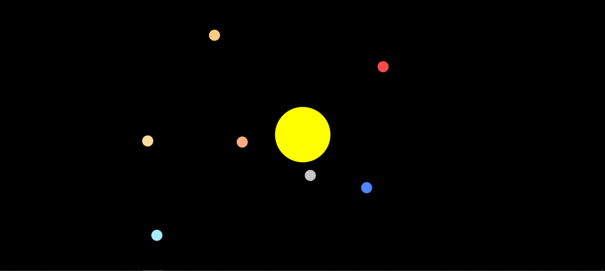

# SISTEMA SOLAR VOLUME 1
😏USE ESSE CÓDIGO EM HTML E CSS PARA VER OS PLANETAS ORBITANDO O SOL.

  
> OS PLANETAS SE MOVEM AO REDOR DO SOL NO SENTIDO HORÁRIO!

## DESCRIÇÃO:
O objetivo deste projeto é oferecer uma representação visual e interativa do sistema solar. Aqui estão as principais funcionalidades implementadas:
1. **Elementos Visuais:** Cada planeta é representado por um círculo colorido.
2. **Órbita Simulada:** Cada planeta orbita em torno do sol com uma velocidade e distância relativa baseada nas propriedades do planeta no sistema solar real.

## NÃO SABE?
- Entendemos que para manipular arquivos em `HTML`, `CSS` e outras linguagens relacionadas, é necessário possuir conhecimento nessas áreas. Para auxiliar nesse aprendizado, oferecemos cursos gratuitos disponíveis:
* [CURSO DE HTML E CSS](https://github.com/VILHALVA/CURSO-DE-HTML-E-CSS)
* [CURSO DE JAVASCRIPT](https://github.com/VILHALVA/CURSO-DE-JAVASCRIPT)
* [CONFIRA MAIS CURSOS](https://github.com/VILHALVA?tab=repositories&q=+topic:CURSO)

## CREDITOS:
- [PROJETO CRIADO PELO VILHALVA](https://github.com/VILHALVA)

